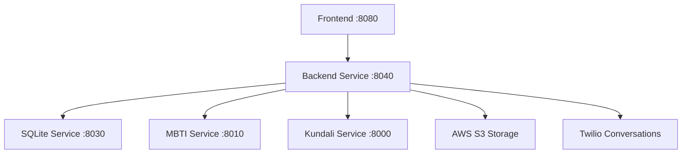

# Destiny Match Backend Service

🚀 **The Core Intelligence Layer for AI-Powered Dating**

This is the main backend service for Destiny Match, housing the AI agent, matching algorithms, and core business logic for the dating platform. Built with Flask and Python, it orchestrates communication between all microservices and provides a comprehensive REST API.

---

## 🎯 **Overview**

The backend service is the central hub of the Destiny Match ecosystem, responsible for:

- **AI Agent Management**: Houses the Destiny conversational AI agent
- **User Authentication**: Secure account creation, login, and session management
- **Matching Engine**: Compatibility scoring using MBTI and Kundali services
- **Filtering System**: AI-powered recommendation filtering based on user preferences
- **Profile Management**: Complete user profile CRUD operations
- **Real-time Chat**: Integration with Twilio for end-to-end messaging
- **Data Security**: Encryption for sensitive data and secure AWS S3 integration

## 🏗️ **Architecture & Workflow**

### **Service Dependencies**



### **Core Workflow**

1. **User Registration Flow**
   ```
   Frontend → Backend → Encrypt Data → SQLite → MBTI Analysis → S3 Upload → Match Generation
   ```

2. **Matching Process**
   ```
   New User → Fetch Opposite Gender → Kundali Scoring → MBTI Compatibility → AI Filtering → Store Matches
   ```

3. **AI Chat Flow**
   ```
   User Message → Destiny Agent → Intent Detection → Tool Selection → Filter Application → Response
   ```

4. **Recommendation Flow**
   ```
   User Request → Filter Cards → AI Analysis → Database Update → Real-time Results
   ```

---

## 📋 **API Endpoints**

### **🔐 Authentication & Account Management**

#### **1. Health Check**
- **Endpoint**: `GET /`
- **Purpose**: Service health verification
- **Input**: None
- **Output**: 
  ```json
  "OK"
  ```
- **Status**: `200`

#### **2. Create Account**
- **Endpoint**: `POST /account:create`
- **Purpose**: Register new user with profile data and images
- **Content-Type**: `multipart/form-data`
- **Input**:
  ```json
  // Form data 'metadata' field:
  {
    "name": "John Doe",
    "email": "john@example.com", 
    "password": "securepassword",
    "phone": "1234567890",
    "city": "mumbai",
    "country": "india",
    "profession": "software engineer",
    "birth_city": "delhi",
    "birth_country": "india", 
    "dob": "1990-05-15",
    "tob": "14:30",
    "gender": "male",
    "hobbies": ["reading", "hiking", "cooking"],
    "Question1": {"Question": "What's your ideal date?", "Answer": "A quiet dinner"},
    "Question2": {"Question": "Describe yourself", "Answer": "Outgoing and friendly"},
    "Question3": {"Question": "What are you looking for?", "Answer": "Long-term relationship"}
  }
  // Files: profile images (max 8)
  ```
- **Output**:
  ```json
  {
    "UID": "generated-uuid-string"
  }
  ```
- **Process**: 
  - Validates email/phone format
  - Encrypts sensitive data (email, phone, password)
  - Processes and uploads images to S3
  - Calculates coordinates for birth location
  - Analyzes personality using MBTI service
  - Triggers async match generation

#### **3. User Login**
- **Endpoint**: `POST /account:login`
- **Purpose**: Authenticate user and return session data
- **Input**:
  ```json
  {
    "email": "john@example.com",
    "password": "securepassword"
  }
  ```
- **Output**:
  ```json
  {
    "LOGIN": "SUCCESSFUL",
    "UID": "user-uuid",
    "NEW_NOTIFICATIONS": [
      {"message": "You have a new match!", "updated": "2024-01-15 10:30:00"}
    ],
    "OLD_NOTIFICATIONS": [],
    "EMAIL": "john@example.com",
    "PHONE": "1234567890", 
    "FILTERS": ["engineers only", "age 25-30"],
    "ERROR": "OK"
  }
  ```

#### **4. Email Verification**
- **Endpoint**: `POST /verify:email`
- **Purpose**: Check if email is available for registration
- **Input**:
  ```json
  {
    "email": "john@example.com"
  }
  ```
- **Output**:
  ```json
  {
    "verify": true  // true if email is available, false if taken
  }
  ```

#### **5. Update Account**
- **Endpoint**: `POST /account:update`
- **Purpose**: Update user profile information
- **Content-Type**: `multipart/form-data`
- **Input**:
  ```json
  // Similar to create account but with 'uid' field required
  {
    "uid": "user-uuid",
    "name": "Updated Name",
    // ... other fields to update
  }
  ```
- **Output**:
  ```json
  {
    "UID": "user-uuid",
    "error": "OK"
  }
  ```

### **👤 Profile & User Data**

#### **6. Get User Profile**
- **Endpoint**: `GET /get:user/<uid>`
- **Purpose**: Retrieve complete user profile data
- **Input**: UID in URL path
- **Output**:
  ```json
  {
    "UID": "user-uuid",
    "NAME": "john doe",
    "DOB": "1990-05-15",
    "CITY": "mumbai", 
    "COUNTRY": "india",
    "IMAGES": ["s3-url-1", "s3-url-2"],
    "HOBBIES": "reading,hiking,cooking",
    "PROFESSION": "software engineer",
    "GENDER": "male",
    "FILTERS": ["engineers only"],
    "EMAIL": "john@example.com",
    "PHONE": "1234567890",
    "Question1": {"Question": "...", "Answer": "..."},
    "Question2": {"Question": "...", "Answer": "..."},
    "Question3": {"Question": "...", "Answer": "..."},
    "MBTI": "INFP",
    "MBTI_DESCRIPTION": "The Mediator personality",
    "ERROR": "OK"
  }
  ```

#### **7. Get Profile with Images**
- **Endpoint**: `GET /get:profile/<uid>`
- **Purpose**: Get profile with base64-encoded images for display
- **Input**: UID in URL path
- **Output**:
  ```json
  {
    "UID": "user-uuid",
    "NAME": "john doe",
    // ... profile data ...
    "IMAGES": ["s3-url-1", "s3-url-2"],  // S3 URLs for images
    "FILTERS": ["engineers only"],
    "Question1": {"Question": "...", "Answer": "..."},
    "error": "OK"
  }
  ```

### **💫 Matching & Recommendations**

#### **8. Get Recommendations**
- **Endpoint**: `GET /get:recommendations/<uid>`
- **Purpose**: Fetch filtered recommendation cards for user
- **Input**: UID in URL path
- **Output**:
  ```json
  {
    "cards": [
      {
        "recommendation_uid": "match-uuid",
        "name": "jane doe",
        "score": [8.5],
        "reason": "You both enjoy hiking and have similar career goals",
        "chat_enabled": false,
        "user_align": false,
        "blocked_by_match": false,
        "blocked_by_user": false,
        "rec_idx": 1,
        "usr_idx": 0,
        "filtered": false,
        "Question1": {"Question": "...", "Answer": "..."},
        "Question2": {"Question": "...", "Answer": "..."},
        "Question3": {"Question": "...", "Answer": "..."}
      }
    ]
  }
  ```

#### **9. Get Awaiting Matches**
- **Endpoint**: `GET /get:awaiting/<uid>`
- **Purpose**: Get matches where one person has aligned but waiting for response
- **Input**: UID in URL path
- **Output**: Same format as recommendations

#### **10. Get Confirmed Matches**
- **Endpoint**: `GET /get:matches/<uid>`
- **Purpose**: Get mutual matches where both users have aligned
- **Input**: UID in URL path  
- **Output**: Same format as recommendations with `chat_enabled: true`

#### **11. User Action (Align/Skip/Block)**
- **Endpoint**: `POST /account:action`
- **Purpose**: Record user action on a recommendation
- **Input**:
  ```json
  {
    "uid": "user-uuid",
    "recommendation_uid": "match-uuid", 
    "action": "align"  // "align", "skip", "block"
  }
  ```
- **Output**:
  ```json
  {
    "error": "OK",
    "queue": "MATCHED",  // "MATCHED", "AWAITING", "None"
    "user_align": true,
    "message": "You have been matched with Jane!",
    "updated": "2024-01-15 10:30:00",
    "user_block": false
  }
  ```

### **🎯 Filtering System**

#### **12. Update Filters**
- **Endpoint**: `POST /update:filter`
- **Purpose**: Remove specific filter from user's active filters
- **Input**:
  ```json
  {
    "uid": "user-uuid",
    "filter": "engineers only"
  }
  ```
- **Output**:
  ```json
  {
    "RECOMMENDATIONS": [/* updated recommendation cards */],
    "RESPONSE": "Recommendations have been updated as per your request.",
    "ERROR": "OK"
  }
  ```

### **🤖 AI Chat (Destiny Agent)**

#### **13. App-Initiated Chat**
- **Endpoint**: `GET/POST /chat:app`  
- **Purpose**: Destiny agent starts conversation about user hobbies
- **Input** (GET - Start new):
  ```json
  {
    "uid": "user-uuid"
  }
  ```
- **Input** (POST - Continue):
  ```json
  {
    "uid": "user-uuid",
    "user_input": "I love hiking in the mountains",
    "history": [
      {"role": "assistant", "content": "What hobbies do you enjoy?"},
      {"role": "user", "content": "I enjoy hiking"}
    ]
  }
  ```
- **Output**:
  ```json
  {
    "message": "That's great! What's your favorite hiking trail?",
    "history": [/* complete conversation history */],
    "continue": true
  }
  ```

#### **14. User-Initiated Chat**
- **Endpoint**: `POST /chat:user`
- **Purpose**: User asks questions or requests filtering
- **Input**:
  ```json
  {
    "uid": "user-uuid", 
    "user_input": "Show me only engineers from Bangalore",
    "history": [/* optional previous conversation */]
  }
  ```
- **Output** (Regular chat):
  ```json
  {
    "message": "I'd be happy to help with your preferences!",
    "history": [/* updated conversation history */],
    "continue": true
  }
  ```
- **Output** (Filter applied):
  ```json
  {
    "message": "I've filtered your recommendations to show engineers from Bangalore.",
    "history": [/* conversation history */],
    "continue": true,
    "filter_applied": true,
    "recommendations": [/* filtered recommendation cards */]
  }
  ```

### **💬 End-to-End Chat (Twilio Integration)**

#### **15. Generate Chat Token**
- **Endpoint**: `GET /e2echat:token/<uid>`
- **Purpose**: Generate Twilio access token for real-time chat
- **Input**: UID in URL path
- **Output**:
  ```json
  {
    "token": "twilio-jwt-token-string",
    "error": "OK"
  }
  ```

#### **16. Get/Create Conversation**
- **Endpoint**: `POST /e2echat:conversation`
- **Purpose**: Get existing or create new Twilio conversation between matched users
- **Input**:
  ```json
  {
    "uid1": "user1-uuid",
    "uid2": "user2-uuid"
  }
  ```
- **Output**:
  ```json
  {
    "conversation_sid": "twilio-conversation-sid",
    "error": "OK"
  }
  ```

---

## 🔧 **Core Functions**

### **Authentication & Security**

#### **`encrypt_password(password)`**
- **Purpose**: Hash password using Argon2
- **Input**: Plain text password
- **Output**: Hashed password string
- **Security**: Time cost=3, Memory=65536 KiB, Parallelism=4

#### **`verify_password(stored_hash, provided_password)`** 
- **Purpose**: Verify password against stored hash
- **Input**: Stored hash, user-provided password
- **Output**: Boolean (True if valid)

#### **`encrypt_sensitive_data(data)` / `decrypt_sensitive_data(encrypted_data)`**
- **Purpose**: Encrypt/decrypt sensitive data using Fernet
- **Input**: Raw data or encrypted data
- **Output**: Encrypted string or decrypted data

### **Matching Engine**

#### **`compute_score(user_1, user_2)`**
- **Purpose**: Calculate compatibility score between two users
- **Input**: Two user dictionaries with DOB, TOB, LAT, LONG, HOBBIES
- **Process**:
  - Calls Kundali service for astrological compatibility (80% weight)
  - Calculates personal compatibility based on hobbies (20% weight)
- **Output**: Compatibility score (0-10 scale)

#### **`populate_matches(uid, gender)`** *(Async)*
- **Purpose**: Find and populate initial matches for new user
- **Process**:
  1. Fetch users of opposite gender
  2. Calculate compatibility scores
  3. Sort by score and select top matches
  4. Apply AI filtering
  5. Store in MATCHING_TABLE

### **AI Filtering System**

#### **`filter_cards(uid, recommendation_cards, new_filter=None)`**
- **Purpose**: AI-powered filtering of recommendation cards
- **Input**: 
  - `uid`: User requesting filtering
  - `recommendation_cards`: List of potential matches
  - `new_filter`: Optional new filter criteria
- **Process**:
  1. Enhance cards with full user data
  2. Apply FilterAgent for AI analysis
  3. Categorize into matched/filtered with reasons
- **Output**: `(matches, filtered, detailed_reasoning)`

#### **`live_filter(uid, new_filter)`**
- **Purpose**: Apply real-time filtering and update database
- **Input**: User UID and filter criteria from conversation
- **Process**:
  1. Fetch current recommendations
  2. Apply filter_cards logic
  3. Update MATCHING_TABLE with new reasons
  4. Mark filtered items appropriately
- **Output**: Updated recommendations with filter response

### **Data Management**

#### **`get_user_data(uid)`**
- **Purpose**: Internal function to get raw user data
- **Input**: User UID
- **Output**: Complete user dictionary with decrypted data

#### **`fetch_queue(uid, queue_type, get_filtered=False)`**
- **Purpose**: Fetch recommendation cards from different queues
- **Input**: 
  - `uid`: User ID
  - `queue_type`: "RECOMMENDATIONS", "AWAITING", "MATCHES"
  - `get_filtered`: Boolean to get filtered-out cards
- **Output**: List of recommendation cards

#### **`update_notifications_or_chats(uid, data, column)`** *(Async)*
- **Purpose**: Update user notifications or chat history in S3
- **Input**: User ID, data array, column type
- **Process**: Upload to S3 and update database URL

---

## 🗄️ **Database Schema**

### **PROFILE_DB Table**
```sql
CREATE TABLE PROFILE_DB (
    UID TEXT PRIMARY KEY,           -- Unique user identifier
    PASSWORD TEXT NOT NULL,         -- Argon2 hashed password
    NAME TEXT NOT NULL,            -- User's name
    PHONE TEXT,                    -- Fernet encrypted phone
    EMAIL TEXT,                    -- Fernet encrypted email  
    EMAIL_HASH TEXT,               -- SHA256 hash for lookup
    CITY TEXT, COUNTRY TEXT,       -- Current location
    PROFESSION TEXT,               -- User's profession
    BIRTH_CITY TEXT, BIRTH_COUNTRY TEXT, -- Birth location
    DOB TEXT, TOB TEXT,            -- Date and time of birth
    GENDER TEXT,                   -- Gender preference
    HOBBIES TEXT,                  -- Comma-separated hobbies
    LAT TEXT, LONG TEXT,           -- Coordinates for matching
    IMAGES TEXT,                   -- S3 URLs (comma-separated)
    CREATED TEXT, LOGIN TEXT,      -- Timestamps
    FILTERS TEXT,                  -- Active filters (';%;' separated)
    NOTIFICATIONS TEXT,            -- S3 URL for notifications
    INITIATE_CHATS TEXT,           -- S3 URL for app chats
    PREFERENCE_CHATS TEXT,         -- S3 URL for user chats
    QUESTION1 TEXT,                -- JSON personality question
    QUESTION2 TEXT,                -- JSON personality question
    QUESTION3 TEXT,                -- JSON personality question
    MBTI TEXT,                     -- Predicted MBTI type
    MBTI_DESCRIPTION TEXT,         -- MBTI description
    MBTI_RESPONSE TEXT             -- Full MBTI service response
);
```

### **MATCHING_TABLE Table**
```sql
CREATE TABLE MATCHING_TABLE (
    UID1 TEXT NOT NULL, UID2 TEXT NOT NULL,  -- User pair
    SCORE REAL,                              -- Compatibility score
    CREATED TEXT, UPDATED TEXT,              -- Timestamps
    ALIGN1 BOOLEAN, ALIGN2 BOOLEAN,          -- User interests
    SKIP1 BOOLEAN, SKIP2 BOOLEAN,            -- Skip flags
    BLOCK1 BOOLEAN, BLOCK2 BOOLEAN,          -- Block flags  
    NAME1 TEXT, NAME2 TEXT,                  -- Cached names
    REASON1 TEXT, REASON2 TEXT,              -- AI-generated reasons
    FILTERED BOOLEAN DEFAULT FALSE,          -- Filter status
    CONVERSATION_SID TEXT,                   -- Twilio conversation
    PRIMARY KEY (UID1, UID2)
);
```

---

## 🌐 **External Service Integration**

### **MBTI Service** (`http://mbti-service:8010`)
- **Endpoint**: `POST /predict`
- **Purpose**: Personality analysis using BERT + LightGBM
- **Input**: `{"text": "combined_personality_responses"}`
- **Output**: `{"result": {"mbti_type": "INFP", "description": "..."}}`

### **Kundali Service** (`http://kundali-service:8000`)
- **Endpoint**: `POST /get:score`
- **Purpose**: Astrological compatibility scoring
- **Input**: 
  ```json
  {
    "DOB1": "1990-05-15", "DOB2": "1992-08-20",
    "TOB1": "14:30", "TOB2": "09:15", 
    "LAT1": "28.6139", "LAT2": "19.0760",
    "LONG1": "77.2090", "LONG2": "72.8777"
  }
  ```
- **Output**: `{"score": 24}` (Guna Milan score out of 36)

### **SQLite Service** (`http://sql-service:8030`)
- **Endpoint**: `POST /execute`
- **Purpose**: Database operations via HTTP
- **Input**: `{"query": "SELECT ...", "params": [...]}`
- **Output**: `{"success": true, "data": [...], "rows_affected": 1}`

---

## 🚀 **Setup & Deployment**

### **Environment Variables**
```bash
# AWS Configuration
S3_ACCESS_ID=your_access_key
S3_ACCESS_KEY=your_secret_key
ENCRYPTION_KEY=your_fernet_key

# OpenAI Integration  
OPENAI_API_KEY=your_openai_key

# Twilio Configuration
TWILIO_ACCOUNT_SID=your_account_sid
TWILIO_API_KEY=your_api_key
TWILIO_API_SECRET=your_api_secret
```

### **Docker Deployment**
```bash
# Build and run with dependencies
docker-compose up -d

# Check service health
curl http://localhost:8040/

# View logs
docker-compose logs backend-service
```

### **Local Development**
```bash
# Install dependencies
pip install -r requirements.txt

# Start service
python backend.py

# Service runs on port 8040
```

---

## 🔍 **Monitoring & Debugging**

### **Health Checks**
- Service health: `GET /`
- Database connectivity: Monitor SQLite service logs
- External services: Check MBTI/Kundali service responses

### **Common Issues**
1. **MBTI Service Timeout**: Fallback to empty response
2. **Kundali Service Error**: Uses random score fallback
3. **S3 Upload Failure**: Returns None, handle gracefully
4. **Database Connection**: Retry mechanism built into adapter

### **Logging**
- **Info Level**: Normal operations, user actions
- **Warning Level**: Fallback mechanisms, minor errors
- **Error Level**: Critical failures, service unavailability

---

## 📚 **API Testing Examples**

### **Create Account**
```bash
curl -X POST http://localhost:8040/account:create \
  -F 'metadata={"name":"John Doe","email":"john@test.com","password":"test123","phone":"1234567890","city":"mumbai","country":"india","profession":"engineer","birth_city":"delhi","birth_country":"india","dob":"1990-05-15","tob":"14:30","gender":"male","hobbies":["reading","coding"],"Question1":{"Question":"Ideal date?","Answer":"Coffee chat"},"Question2":{"Question":"Describe yourself","Answer":"Tech enthusiast"},"Question3":{"Question":"Looking for?","Answer":"Meaningful connection"}}' \
  -F 'images=@profile1.jpg' \
  -F 'images=@profile2.jpg'
```

### **Chat with Destiny**
```bash
curl -X POST http://localhost:8040/chat:user \
  -H "Content-Type: application/json" \
  -d '{"uid":"user-uuid","user_input":"Show me engineers from Bangalore","history":[]}'
```

### **Get Recommendations**
```bash
curl http://localhost:8040/get:recommendations/user-uuid
```

---

*This backend service powers the intelligent matching and conversation capabilities of Destiny Match, providing a robust foundation for AI-driven dating experiences.*
